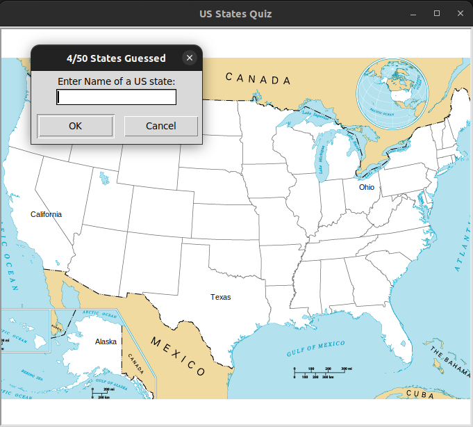

# US States Quiz Game

 <!-- You can include a screenshot or image related to your project here -->

Welcome to the US States Quiz Game! This interactive Python project allows you to test your knowledge of the US states by guessing their names on a map. The game features an engaging interface where you can input your guesses and see your progress as you identify states.

## Features

- Interactive map display using the Turtle graphics library.
- Test your knowledge of US states' names and locations.
- Learn geography in a fun and engaging way.
- Track your progress with the number of guessed states.
- Receive pop-up error messages for invalid inputs.
- Enjoy a congratulatory message upon guessing all states correctly.

## Usage

# Installation

1. Ensure you have Python installed. If not, download it from [python.org](https://www.python.org/downloads/).
2. Install the required libraries using `pip install pandas turtle tk`.
3. Clone this repository using `git clone https://github.com/yourusername/us-states-quiz.git`
4. Run the main.py to start the game.
5. Input the names of US states and see them being marked on the map.
6. Receive instant feedback on your guesses and errors.

## Data Source

The game utilizes data from a CSV file (`50_states.csv`) containing US state names and coordinates.

## License

This project is licensed under the [MIT License](LICENSE).

## Acknowledgments

- The Turtle graphics library for creating the interactive map.
- [pandas](https://pandas.pydata.org/) for data handling and manipulation.
- [tkinter](https://docs.python.org/3/library/tkinter.html) for pop-up error messages.

Feel free to contribute, suggest improvements, or use this project for educational purposes.

<!-- You can add more sections or modify the existing ones to tailor the description to your project's specific details. -->
